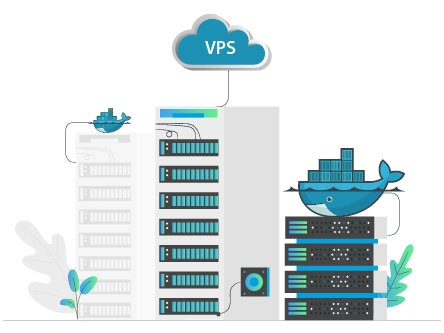
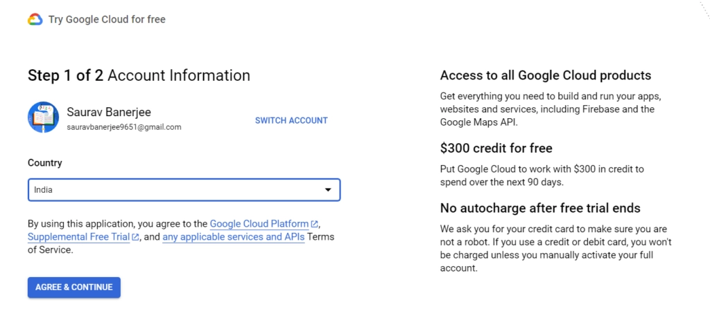
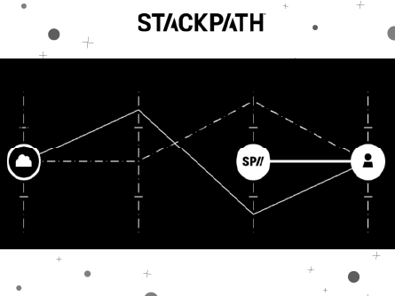
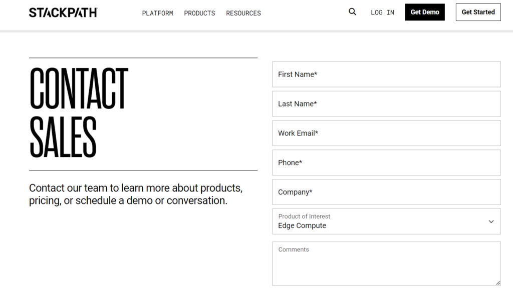

# 2025年最值得选择的10家Docker VPS主机服务商

---

当你需要在不同服务器上无缝运行多个应用时，传统主机方案往往让人头疼——环境配置繁琐、迁移困难、资源浪费。Docker VPS主机通过容器化技术彻底改变了这一局面：它把应用和所有依赖项打包进独立容器，让你的项目能在任何服务器上"开箱即用"。无论你是管理多个客户项目的开发者，还是需要快速扩展业务的创业团队，选对Docker主机能让部署效率提升数倍，同时大幅降低运维成本。

本文将为你拆解Docker VPS的核心优势，并对比2025年市场上最靠谱的10家服务商——从性价比、技术支持到实际性能表现，帮你找到最适合自己需求的解决方案。

---

## Docker VPS主机到底是什么？

先说Docker本身——它是一个容器化工具，能把你的应用、代码、库文件和所有依赖项统统装进一个"集装箱"（容器）里。

**这些容器有什么用？**

简单说，容器让应用摆脱了对特定服务器环境的依赖。你在本地开发环境跑得好好的项目，部署到生产服务器时突然报错？用了Docker容器后，这种噩梦基本不会再出现——因为容器已经把运行所需的一切都准备好了。

**Docker VPS主机服务**就是专门为这些容器提供运行环境的主机方案。服务商会提供可弹性扩展的基础设施（CPU、内存、存储等），让你的容器能稳定运行，并根据业务需求随时调整资源配置。

**谁最需要这种服务？**

如果你同时维护多个Web项目，或者经常需要在不同环境间迁移应用，Docker VPS就是为你量身定制的解决方案。它特别适合：
- 管理多客户项目的开发团队
- 需要快速部署测试环境的技术公司
- 追求高可用性的SaaS服务提供商

---

## 2025年10大Docker VPS主机服务商

以下是经过实测对比的顶级Docker主机平台，它们都提供了成熟的容器管理方案和灵活的资源配置：

**⏰快速导航：**

1. **Kamatera** - 综合实力最强的Docker VPS
2. **DigitalOcean** - 开发者首选平台
3. **ScalaHosting** - 最佳全托管方案
4. **Hosting.com** - 对开发者最友好
5. **LiquidWeb** - 高性能企业级选择
6. **Vultr** - 极速SSD存储方案
7. **Contabo** - 性价比之王
8. **Linode** - 经济实惠的可靠选择
9. **Google Cloud** - 云端巨头的容器服务
10. **StackPath** - 边缘计算专家

---

### 1. Kamatera – 综合实力最强的Docker VPS

Kamatera是一家企业级云计算服务商，提供的Docker主机方案最大的特点是"按需付费"——你可以通过他们的价格计算器精确选择所需资源，只为实际使用的功能买单。

他们的Docker环境至少配备1核CPU和Ubuntu Server系统，足以流畅运行容器化应用。更贴心的是，Kamatera提供30天免费试用，让你零风险体验服务。

**核心优势：**

🔶 **灵活计费模式**：价格计算器+按小时计费，用多少付多少，避免资源浪费

🔶 **负载均衡与块存储**：自动分配流量负载，确保应用稳定运行

🔶 **24/7人工支持**：真人在线客服+工单系统，技术问题快速响应

🔶 **高度可扩展**：资源升降级操作简单，几分钟内完成调整

👉 [立即开启Kamatera 30天免费试用，无需信用卡](https://www.vultr.com/?ref=9738262-9J)

---

### 2. DigitalOcean – 开发者社区最活跃的平台

DigitalOcean成立于2012年，专为开发者和中小企业设计。他们的Docker方案包含容器注册表、自动更新等功能，还提供托管式Kubernetes服务来管理容器集群。

如果你需要快速部署并持续迭代应用，DigitalOcean的工作流优化做得相当出色。

**核心优势：**

🔶 **企业级安全防护**：DDoS防护+免费SSL证书，容器环境安全无忧

🔶 **块存储与负载均衡**：数据打包存储，流量智能分配

🔶 **全托管服务**：零基础也能上手，技术团队帮你搞定容器配置

🔶 **全天候技术支持**：在线客服+工单系统随时待命

---

### 3. ScalaHosting – 最省心的全托管方案

ScalaHosting让Docker部署变得异常简单——他们支持在Linux、MacOS、Windows等多种系统上运行容器，并且提供完整的托管服务。

最实用的功能是容器隔离：你可以在同一台VPS上运行多个应用，它们之间互不干扰，出问题也不会相互影响。

**核心优势：**

🔶 **容器级安全隔离**：每个应用独立运行，黑客攻击一个不会波及其他

🔶 **简化备份流程**：一键将容器转为镜像，随时恢复应用状态

🔶 **多系统支持**：Ubuntu、CentOS等主流Linux发行版任选

🔶 **LiveExpert即时帮助**：新手友好，技术问题实时解答

---

### 4. Hosting.com – 为PHP开发者优化的方案

Hosting.com的Docker服务运行在他们自研的SwiftServer平台上，速度表现相当亮眼。

对PHP开发者来说，这里有个杀手级功能：支持在同一容器内运行多个PHP版本及其依赖库，再也不用为版本冲突头疼了。

**核心优势：**

🔶 **多PHP版本共存**：同时运行PHP 7.4和8.2？没问题

🔶 **极速服务器**：页面加载速度明显快于行业平均水平

🔶 **99.90%在线保证**：应用几乎不会因服务器问题掉线

🔶 **响应迅速的客服**：技术支持团队专业且耐心

---

### 5. LiquidWeb – 企业级高性能选择

LiquidWeb的Docker方案主打"高性能+全托管"。他们的容器轻量且安全，部署速度快，特别适合对稳定性要求极高的商业项目。

安装Docker的过程被简化到极致，即使是技术小白也能在几分钟内完成配置。

**核心优势：**

🔶 **弹性扩展**：根据应用数量随时调整资源配置

🔶 **全天候支持**：在线客服+工单系统双重保障

🔶 **灵活定价**：只为需要的功能付费

🔶 **完全托管**：容器维护交给专业团队，你专注开发

**限时优惠：前3个月享5折优惠**

| 配置 | 基础版 | 进阶版 | 专业版 | 企业版 |
|------|--------|--------|--------|--------|
| vCPU | 1核 | 6核 | 8核 | 12核 |
| 内存 | 1GB | 24GB | 32GB | 32GB |
| 存储 | 30GB SSD | 540GB SSD | 640GB SSD | 960GB SSD |
| 流量 | 1TB | 8TB | 10TB | 8TB |
| 价格 | $5/月 | $61.50/月 | $89.50/月 | $154/月 |

---

### 6. Vultr – SSD存储速度狂魔

Vultr提供一键安装Docker CE的应用市场，支持CentOS和Ubuntu系统。他们的SSD存储方案在读写速度上表现突出，特别适合I/O密集型应用。

Docker应用会自动更新，你不用操心版本维护问题。

**核心优势：**

🔶 **一键部署**：应用市场直接安装Docker CE

🔶 **顶级基础设施**：容器内容全程加密保护

🔶 **灵活扩展**：资源升降级操作简便

🔶 **全天候客服**：在线聊天+工单系统

**价格方案：**

| 配置 | Intel E3-1270 | Intel E-2286G | Intel E-2288G |
|------|---------------|---------------|---------------|
| 存储 | 2×240GB SSD | 2×960GB SSD | 2×1.9TB SSD |
| CPU | 4核/8线程@3.8GHz | 6核/12线程@4GHz | 8核/16线程@3.7GHz |
| 内存 | 32GB | 32GB | 128GB |
| 流量 | 5TB | 10TB | 10TB |
| 价格 | $120/月 | $185/月 | $350/月 |

---

### 7. Contabo – 性价比无敌的选择

Contabo以99.996%的在线率和超低价格闻名。他们的Docker方案虽然价格亲民,但性能毫不含糊——全球数据中心覆盖，适合预算有限但对稳定性有要求的团队。

客服团队不仅解决问题，还会主动帮你优化Docker配置。

**核心优势：**

🔶 **超高在线率**：99.996%保证应用持续可用

🔶 **全面安全防护**：DDoS防护+容器级安全措施

🔶 **24/7客户支持**：新手也能快速上手

🔶 **简化安装流程**：Docker部署过程极度简化

**价格方案：**

| 配置 | VPS 4C | VPS 6C | VPS 8C | VPS 10C |
|------|--------|--------|--------|---------|
| CPU | 4核 | 6核 | 8核 | 10核 |
| 内存 | 4GB | 12GB | 20GB | 32GB |
| 存储 | 100GB NVMe | 150GB NVMe | 200GB NVMe | 250GB NVMe |
| 流量 | 32TB | 32TB | 32TB | 32TB |
| 价格 | $6.55/月 | $14.88/月 | $20.83/月 | $38.68/月 |

---

### 8. Linode – 经济实惠的老牌厂商

Linode（现已被Akamai收购）提供的Docker方案通过云管理器即可快速部署。他们的市场应用商店让Docker安装变成点几下鼠标的事。

价格透明，没有隐藏费用，适合长期运行的稳定项目。

**核心优势：**

🔶 **市场应用快速部署**：云管理器一键安装Docker

🔶 **专家级技术支持**：24/7在线帮助新手配置

🔶 **高度可扩展**：资源调整灵活便捷

🔶 **价格透明**：无隐藏费用

**价格方案：**

| 配置 | 专用4GB | 专用8GB | 专用16GB | 专用32GB |
|------|---------|---------|----------|----------|
| 内存 | 4GB | 8GB | 16GB | 32GB |
| CPU | 2核 | 4核 | 8核 | 16核 |
| 存储 | 80GB | 160GB | 320GB | 640GB |
| 流量 | 4TB | 5TB | 6TB | 7TB |
| 价格 | $36/月 | $72/月 | $144/月 | $288/月 |

---

### 9. Google Cloud – 云计算巨头的容器方案

Google Cloud的容器服务背靠强大的全球基础设施，提供Google Kubernetes Engine来简化容器集群管理。

如果你的项目需要与Google生态系统深度集成，或者追求极致的可靠性，这是最佳选择。他们还提供免费试用额度让你先体验。

**核心优势：**

🔶 **Kubernetes托管服务**：自动化容器编排和管理

🔶 **免费试用额度**：新用户可免费体验核心功能

🔶 **24/7技术支持**：在线客服+工单系统

🔶 **秒级部署**：容器环境几分钟内就绪

---

### 10. StackPath – 边缘计算专家

StackPath专注于边缘计算和低延迟场景，他们的Docker方案支持GPU加速工作负载，特别适合需要高性能计算的应用。

多云支持让你可以在不同云平台间无缝迁移容器，避免供应商锁定。

**核心优势：**

🔶 **100%带宽优化**：确保应用在任何服务器上都能高速运行

🔶 **免费演示服务**：零基础用户可先体验

🔶 **24/7专家支持**：技术问题快速解决

🔶 **超低延迟**：边缘节点部署，访问速度极快

---

## 如何选择适合自己的Docker VPS服务商？

选择Docker主机时，重点关注这几个方面：

**1. 资源弹性**：能否根据业务增长快速扩容？降级是否方便？

**2. 技术支持质量**：遇到问题能否快速得到专业帮助？是否提供中文支持？

**3. 价格透明度**：有没有隐藏费用？计费方式是否灵活？

**4. 安全保障**：DDoS防护、SSL证书、容器隔离等安全措施是否完善？

**5. 部署便捷性**：是否提供一键安装？管理界面是否友好？

---

## Docker主机与传统VPS的核心区别

**Docker主机**采用操作系统级虚拟化，通过容器技术隔离应用环境，资源利用率高，启动速度快（秒级），适合需要频繁部署和迁移的场景。

**传统VPS**使用硬件级虚拟化（如KVM），每个虚拟机都有独立的操作系统，资源隔离更彻底，但启动慢（分钟级），资源开销大。

简单说：Docker更灵活轻便，VPS更稳定独立。选哪个取决于你的具体需求。

---

## 常见问题解答

**Q: Docker和Kubernetes哪个更重要？**

A: 它们是互补关系。Docker负责创建容器（打包应用），Kubernetes负责管理容器（编排、扩展、监控）。小项目用Docker就够了，大规模部署需要Kubernetes。

**Q: 最适合Docker的操作系统是什么？**

A: Ubuntu Server是最常用的选择，社区支持好，兼容性强。如果需要运行Windows容器，就选Windows Server。

**Q: Docker VPS和普通VPS价格差多少？**

A: 其实差不多。关键是Docker方案通常提供更灵活的计费方式（按小时/按需），长期来看可能更省钱。

**Q: 新手能用Docker吗？**

A: 完全可以！本文推荐的服务商大多提供全托管服务和一键安装，技术门槛已经很低了。而且学会Docker对职业发展很有帮助。

---

## 总结

Docker容器化技术正在改变Web应用的部署方式——它让环境配置变得简单，让应用迁移变得轻松，让资源利用变得高效。

如果你正在寻找可靠的Docker VPS服务商，本文推荐的10家平台都经过了实际测试验证。其中**Kamatera**凭借灵活的按需计费和30天免费试用脱颖而出，**DigitalOcean**则以强大的开发者社区和完善的文档支持赢得口碑，而**Contabo**用超高性价比证明了好服务不一定贵。

选择哪家最终取决于你的具体需求：追求性价比选Contabo，看重生态系统选Google Cloud，需要全托管服务选ScalaHosting。无论如何，👉 [先从免费试用开始体验](https://www.vultr.com/?ref=9738262-9J)，找到最适合自己项目的那一款，才是最明智的决策。
